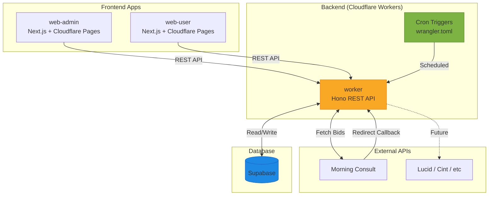
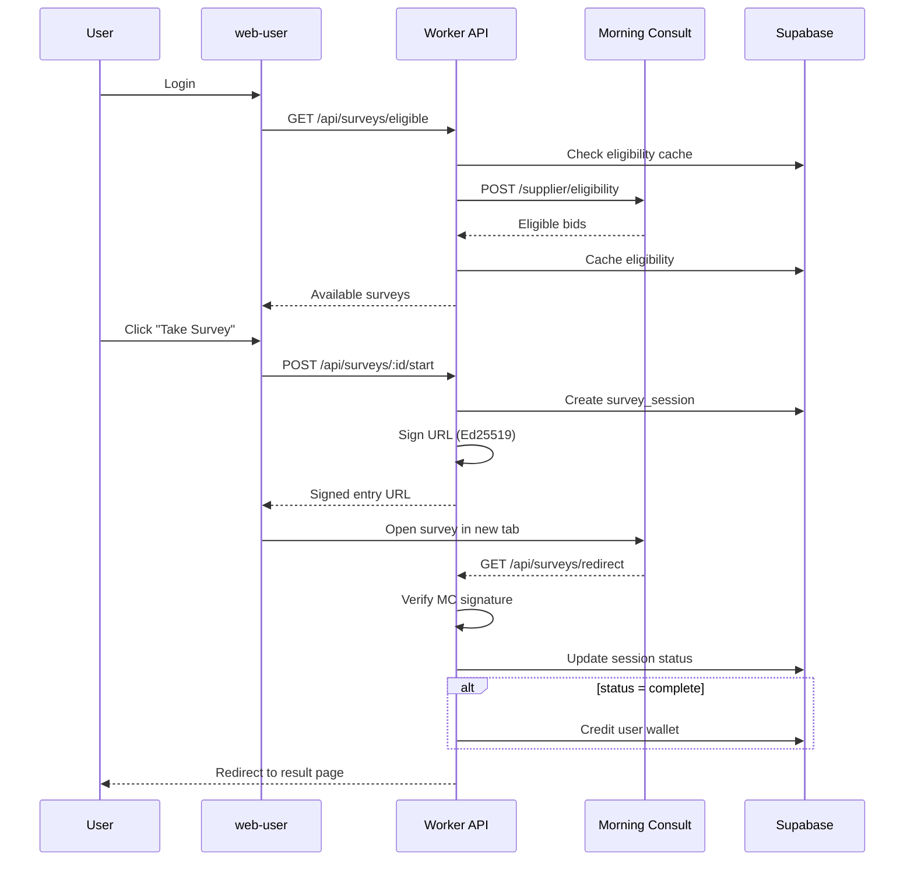

# Survey Inventory System - Development Plan

**Version:** 2.0  
**Date:** February 4, 2026  
**Status:** Draft - Pending Review

---

## Executive Summary

ShopperArmy is expanding survey inventory by integrating with external survey providers (starting with Morning Consult). This plan covers the phased development of infrastructure to pull, store, display, and eventually auto-deploy survey inventory.

> [!IMPORTANT]
> **Architecture Principle:** All database communication MUST go through the Worker API. Frontend apps (`web-admin`, `web-user`) should never connect directly to Supabase.

---

## System Architecture



---

## Application Overview

| App | Type | Purpose | Deployment |
|-----|------|---------|------------|
| `apps/worker` | Cloudflare Worker | Backend API, cron jobs, external integrations | Cloudflare Workers |
| `apps/web-admin` | Next.js | Admin dashboard for survey management | Cloudflare Pages |
| `apps/web-user` | Next.js | User-facing survey feed & wallet | Cloudflare Pages |

---

## Phase 1: Survey Inventory Dashboard

### Objective
Create visibility into available external surveys with all targeting and economic details.

### 1.1 Database Schema

```sql
-- Survey Providers (Morning Consult, Lucid, etc.)
CREATE TABLE survey_providers (
    id UUID PRIMARY KEY DEFAULT gen_random_uuid(),
    name TEXT NOT NULL,
    slug TEXT UNIQUE NOT NULL,
    api_base_url TEXT,
    credentials JSONB,  -- encrypted API keys
    supplier_id UUID,   -- MC supplier UUID
    private_key TEXT,   -- Ed25519 (encrypted)
    public_key TEXT,    -- Ed25519
    min_cpi_cents INTEGER DEFAULT 200,
    user_payout_pct INTEGER DEFAULT 50,
    redirect_urls JSONB,
    is_active BOOLEAN DEFAULT true,
    created_at TIMESTAMPTZ DEFAULT now(),
    updated_at TIMESTAMPTZ DEFAULT now()
);

-- External Surveys (Bids)
CREATE TABLE surveys (
    id UUID PRIMARY KEY DEFAULT gen_random_uuid(),
    provider_id UUID REFERENCES survey_providers(id),
    bid_id TEXT NOT NULL,  -- external provider's ID
    name TEXT,
    country TEXT,
    topic TEXT,
    survey_url_base TEXT,
    length_of_interview_seconds INTEGER,
    incidence_rate FLOAT,
    published_at TIMESTAMPTZ,
    expires_at TIMESTAMPTZ,
    is_active BOOLEAN DEFAULT true,
    raw_json JSONB,
    last_synced_at TIMESTAMPTZ,
    created_at TIMESTAMPTZ DEFAULT now(),
    updated_at TIMESTAMPTZ DEFAULT now(),
    UNIQUE(provider_id, bid_id)
);

-- Survey Quotas (targeting segments)
CREATE TABLE survey_quotas (
    id UUID PRIMARY KEY DEFAULT gen_random_uuid(),
    survey_id UUID REFERENCES surveys(id) ON DELETE CASCADE,
    quota_id TEXT NOT NULL,
    cpi_cents INTEGER NOT NULL,
    completes_required INTEGER,
    completes_current INTEGER DEFAULT 0,
    is_open BOOLEAN DEFAULT true,
    raw_json JSONB,
    created_at TIMESTAMPTZ DEFAULT now(),
    updated_at TIMESTAMPTZ DEFAULT now(),
    UNIQUE(survey_id, quota_id)
);

-- Quota Qualifications (age, gender, etc.)
CREATE TABLE quota_qualifications (
    id UUID PRIMARY KEY DEFAULT gen_random_uuid(),
    quota_id UUID REFERENCES survey_quotas(id) ON DELETE CASCADE,
    qualification_type TEXT NOT NULL,
    qualification_values JSONB NOT NULL,
    created_at TIMESTAMPTZ DEFAULT now()
);

-- Qualification Legend (decode provider codes)
CREATE TABLE qualification_legend (
    id UUID PRIMARY KEY DEFAULT gen_random_uuid(),
    provider_id UUID REFERENCES survey_providers(id),
    qualification_type TEXT NOT NULL,
    response_id TEXT NOT NULL,
    response_text TEXT NOT NULL,
    created_at TIMESTAMPTZ DEFAULT now(),
    UNIQUE(provider_id, qualification_type, response_id)
);

-- Sync Job Logs
CREATE TABLE sync_job_logs (
    id UUID PRIMARY KEY DEFAULT gen_random_uuid(),
    job_id TEXT NOT NULL,
    status TEXT NOT NULL,
    surveys_added INTEGER DEFAULT 0,
    surveys_updated INTEGER DEFAULT 0,
    surveys_closed INTEGER DEFAULT 0,
    error_message TEXT,
    started_at TIMESTAMPTZ DEFAULT now(),
    completed_at TIMESTAMPTZ
);
```

### 1.2 Worker API Routes (Phase 1)

```
apps/worker/src/routes/
├── admin/
│   ├── providers.ts      # GET/POST/PUT /api/admin/providers
│   ├── surveys.ts        # GET /api/admin/surveys (with filters)
│   ├── surveys/[id].ts   # GET /api/admin/surveys/:id (detail view)
│   ├── quotas.ts         # GET /api/admin/surveys/:id/quotas
│   ├── legend.ts         # GET /api/admin/providers/:id/legend
│   ├── jobs.ts           # GET/POST /api/admin/jobs
│   └── stats.ts          # GET /api/admin/stats
└── internal/
    └── sync.ts           # POST /api/internal/sync (cron trigger)
```

### 1.3 Cron Job: Survey Sync

| Setting | Value |
|---------|-------|
| Schedule | `0 * * * *` (every hour) |
| Endpoint | `POST /api/internal/sync` |
| Logic | Pull bids → upsert surveys → upsert quotas → mark inactive |

**Sync Flow:**
1. Fetch `GET /supplier/bids` from Morning Consult
2. For each bid: upsert `surveys` record
3. For each quota: upsert `survey_quotas` record
4. For each qualification: upsert `quota_qualifications`
5. Mark surveys as inactive if not in API response
6. Log sync result to `sync_job_logs`

### 1.4 Admin Dashboard (Phase 1)

**Pages:**

| Route | Component | API Endpoint |
|-------|-----------|--------------|
| `/dashboard` | Stats overview | `GET /api/admin/stats` |
| `/surveys` | Inventory table | `GET /api/admin/surveys` |
| `/surveys/[id]` | Survey detail + quotas | `GET /api/admin/surveys/:id` |
| `/providers` | Provider list | `GET /api/admin/providers` |
| `/providers/[id]` | Provider config | `GET/PUT /api/admin/providers/:id` |
| `/providers/[id]/legend` | Qualification legend | `GET /api/admin/providers/:id/legend` |
| `/jobs` | Sync job history | `GET /api/admin/jobs` |

**Survey Table Columns:**
- Provider, Survey ID, Topic, Country
- Length (mins), CPI Range ($X-$Y)
- Total Slots, Filled, Fill %
- Quotas (count), Status, Expires, Last Sync

**Survey Detail View:**
- All quotas with decoded qualifications
- Gender | Age | Language → Human-readable values

---

## Phase 2: User-Facing Surveys & Payouts

### Objective
Auto-deploy surveys to users with Ed25519 signed URLs and handle completions.

### 2.1 Additional Database Tables

```sql
-- User Survey Eligibility Cache
CREATE TABLE user_survey_eligibility (
    id UUID PRIMARY KEY DEFAULT gen_random_uuid(),
    user_id UUID NOT NULL,
    provider_id UUID REFERENCES survey_providers(id),
    eligible_bids JSONB,  -- [{bid_id, quota_ids[], cpi, loi}]
    best_bid JSONB,       -- Pre-computed for quick display
    fetched_at TIMESTAMPTZ DEFAULT now()
);

-- Survey Sessions (user attempts)
CREATE TABLE survey_sessions (
    id UUID PRIMARY KEY DEFAULT gen_random_uuid(),
    user_id UUID NOT NULL,
    provider_id UUID REFERENCES survey_providers(id),
    survey_id UUID REFERENCES surveys(id),
    bid_id TEXT NOT NULL,
    quota_id TEXT,
    cpi_at_click INTEGER,
    expected_payout INTEGER,  -- cents
    actual_payout INTEGER,    -- cents
    status TEXT DEFAULT 'pending',  -- pending, complete, screenout, over_quota, quality_term, timeout
    status_detail TEXT,
    mc_session_id TEXT,
    started_at TIMESTAMPTZ DEFAULT now(),
    completed_at TIMESTAMPTZ
);
```

### 2.2 Business Rules

| Rule | Value |
|------|-------|
| Minimum CPI Threshold | $2.00 (200 cents) |
| User Payout Percentage | 50% |
| Minimum User Payout | $1.00 |
| Eligibility Cache TTL | 60 seconds |

**Payout Formula:**
```javascript
user_payout_dollars = (cpi_cents * user_payout_pct / 100) / 100;
// $4.00 CPI × 50% = $2.00 user payout
```

### 2.3 Worker API Routes (Phase 2)

```
apps/worker/src/routes/
├── surveys/
│   ├── eligible.ts       # GET /api/surveys/eligible
│   ├── start.ts          # POST /api/surveys/:id/start
│   └── redirect.ts       # GET /api/surveys/redirect (MC callback)
└── users/
    └── wallet.ts         # GET /api/users/:id/wallet
```

### 2.4 User Flow



### 2.5 Ed25519 URL Signing

**Entry URL Format:**
```
https://surveys.insights-today.com/v1/survey/entry
  ?bid_id={bid_id}
  &panelist_id={user_id}
  &supplier_id={supplier_id}
  &session_metadata={session_id}
  &qualifications=age,{age},gender,{gender_code}
  &signature={ed25519_signature}
```

**Implementation:**
1. Construct query string without signature
2. Sign with provider's Ed25519 private key
3. Append `&signature={base64_signature}`

### 2.6 Redirect Handling

| Status | Description | Payout |
|--------|-------------|--------|
| `complete` | Survey finished | ✅ Yes |
| `screenout` | User didn't qualify | ❌ No |
| `over_quota` | Quota filled | ❌ No |
| `quality_term` | Failed quality check | ❌ No |
| `timeout` | Session expired | ❌ No |

### 2.7 web-user Pages

| Route | Purpose |
|-------|---------|
| `/surveys` | Available survey feed |
| `/surveys/offer` | Payout modal |
| `/redirect/success` | Completion confirmation |
| `/redirect/screenout` | Disqualification message |
| `/redirect/error` | Error handling |
| `/wallet` | Earnings history |

---

## Development Checklist

### Phase 1: Survey Inventory Dashboard

#### Backend (Worker)
- [ ] Create database migrations for Phase 1 tables
- [ ] Implement Morning Consult client (`src/lib/mc/client.ts`)
- [ ] Implement provider strategy pattern (`src/lib/providers/`)
- [ ] Build survey sync job runner (`src/lib/jobs/survey-sync.ts`)
- [ ] Add admin API routes (providers, surveys, quotas, legend, jobs, stats)
- [ ] Configure hourly cron trigger in `wrangler.toml`

#### Frontend (web-admin)
- [ ] Set up Worker API client with types
- [ ] Build Dashboard page with stats
- [ ] Build Survey Inventory table with filters
- [ ] Build Survey Detail page with quotas
- [ ] Build Provider Configuration pages
- [ ] Build Qualification Legend page
- [ ] Build Sync Job history page

---

### Phase 2: User-Facing Surveys

#### Backend (Worker)
- [ ] Create database migrations for Phase 2 tables
- [ ] Implement eligibility check (`POST /supplier/eligibility`)
- [ ] Implement Ed25519 URL signing
- [ ] Build redirect handler with signature verification
- [ ] Implement wallet credit logic
- [ ] Add user-facing API routes (eligible, start, redirect, wallet)

#### Frontend (web-user)
- [ ] Set up Worker API client
- [ ] Build Survey Card component
- [ ] Build Offer Modal component
- [ ] Build Redirect result pages
- [ ] Build Wallet/Earnings page

---

## Cron Jobs Summary

| Job ID | Schedule | Description |
|--------|----------|-------------|
| `survey-sync` | `0 * * * *` | Sync surveys from Morning Consult |
| `eligibility-refresh` | `*/30 * * * *` | Refresh stale eligibility cache (Phase 2) |
| `log-cleanup` | `0 0 * * *` | Delete old sync/session logs |

---

## Success Metrics

### Phase 1
- [ ] Dashboard displays real survey inventory
- [ ] Sync job runs reliably every hour
- [ ] Team can view surveys and quota details
- [ ] Qualification codes decoded to human labels
- [ ] Data freshness < 90 minutes

### Phase 2
- [ ] Users see personalized survey offers
- [ ] Payout calculation accurate (50% of CPI)
- [ ] Only surveys ≥ $2.00 CPI shown
- [ ] Entry URLs Ed25519 signed
- [ ] Redirect callbacks verified
- [ ] Completed surveys credit wallets immediately

---

## Open Questions

1. **web-user App:** Does `apps/web-user` need to be created, or is there an existing user-facing app?
2. **Auth Strategy:** Supabase Auth or custom JWT for user authentication?
3. **Profile Enrichment:** Do we need to collect `household_language` from users?
4. **Multiple Surveys:** Show one best survey or multiple options to users?
5. **Provider Priority:** After Morning Consult, which provider next? (Lucid, Cint, etc.)
