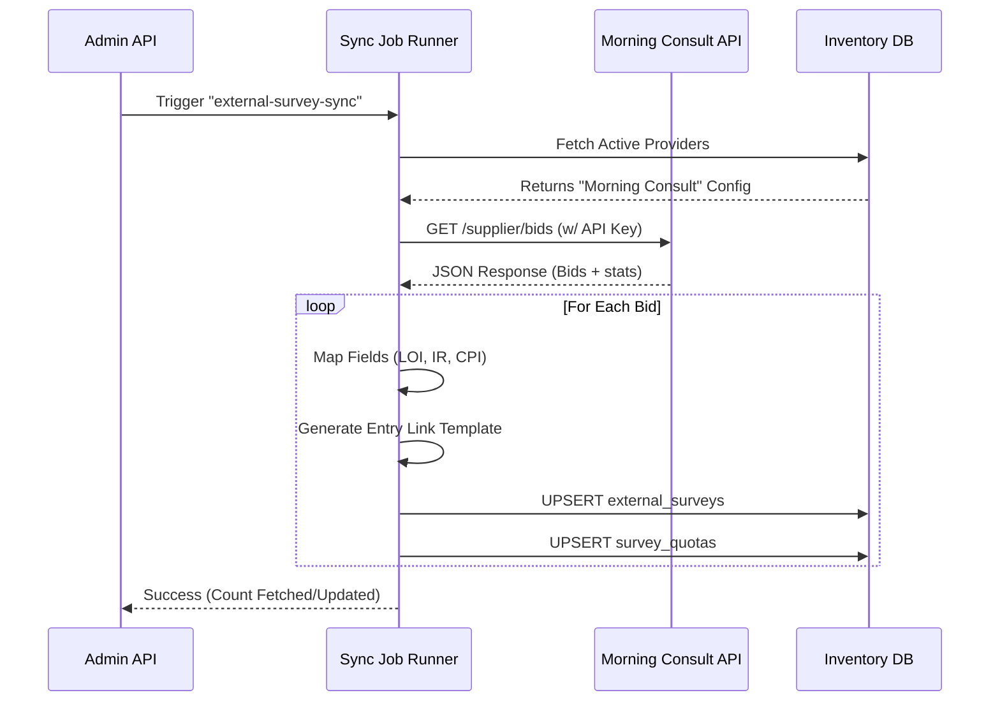

# Morning Consult Survey Integration

## Overview
This document details the integration with the **Morning Consult Sample API**. The integration is designed to fetch survey "bids" (inventory), map them to our internal data structure, and persist them for the ShopperArmy platform.

### Architecture
The integration uses a **Strategy Pattern** within the existing Sync Job infrastructure.

- **Job Trigger**: `admin/app/api/sync-jobs/run`
- **Runner**: `admin/lib/jobs/runners/external-survey-sync.ts`
- **Strategy**: `admin/lib/providers/morning-consult.strategy.ts`
- **Database**: Supabase `inventory` schema (tables: `external_surveys`, `survey_quotas`)

---

## 1. The Trigger
The sync process is initiated via an on-demand API call (typically scheduled via Cron or triggered manually).

**Endpoint**: `POST /api/sync-jobs/run`
**Payload**:
```json
{
  "jobDefinitionId": "external-survey-sync"
}
```

## 2. Execution Flow

### Step A: Configuration Load
The runner loads the generic job configuration (e.g., `batchSize`) and queries the database for active *External Survey Providers*. It identifies "Morning Consult" by its slug (`morning-consult`).

### Step B: Strategy Execution
The `MorningConsultProviderStrategy` executes the following logic:

1.  **Authentication**:
    -   Retrieves `api_key` and `base_url` from the provider's `config` JSON column.
    -   Authenticate requests using `Authorization: Bearer <API_KEY>`.

2.  **Fetching Inventory**:
    -   Calls `GET /supplier/bids` on the Morning Consult API.
    -   *URL (Sandbox)*: `https://sample-api-sandbox.morningconsult.com/v1`

3.  **Data Mapping**:
    -   **Identity**: Maps `bid.id` to `external_bid_id`.
    -   **Statistics**:
        -   `length_of_interview_seconds` -> `median_length_of_interview` (or `estimated` fallback).
        -   `incidence_rate` -> `incidence_rate` (converted to 0.0-1.0 float).
    -   **Entry Link**:
        -   The API does **not** return a full entry link.
        -   We construct a **Template URL** pointing to the Prescreener:
        -   `{prescreener_url}/survey/entry?bid_id={BID_ID}&supplier_id={SUPPLIER_ID}`
        -   *Note*: This template requires `panelist_id` and `signature` to be appended at runtime (see "Runtime Requirements").

4.  **Quota Mapping**:
    -   Iterates through `bid.quotas`.
    -   Extracts `cost_per_interview` (CPI) in cents.
    -   Maps `num_available` to `completes_required`.

## 3. Database Persistence
The mapped data is upserted into the `inventory` schema:

1.  **`external_surveys`**:
    -   Stores high-level metadata: Title, Topic, Country, Base URL.
2.  **`survey_quotas`**:
    -   Stores pricing and targeting info. This is critical for determining how much to pay users.

### Sequence Diagram



---

## 4. Runtime Requirements (Frontend/Redemption)
To successfully send a user to a survey, the application **must** sign the Entry Link Template.

**The Flow:**
1.  User clicks "Take Survey".
2.  Backend retrieves the `survey_url_base` template.
3.  Backend appends:
    -   `&panelist_id={INTERNAL_USER_ID}`
    -   `&signature={HMAC_SHA256_SIGNATURE}`
4.  User is redirected to the signed URL.

> **Warning**: The sync job **does not** generate signatures. This is a security measure to prevent re-use of links. Signatures must be generated on-the-fly using the private key associated with the registered public key.

---

## Configuration Reference
The `external_survey_providers` table entry for Morning Consult must contain:

```json
{
  "api_key": "YOUR_MORNING_CONSULT_API_KEY",
  "base_url": "https://sample-api-sandbox.morningconsult.com/v1",
  "prescreener_url": "https://sample-view-sandbox.morningconsult.com",
  "supplier_id": "OPTIONAL_IF_AUTO_FETCH_FAILS"
}
```
