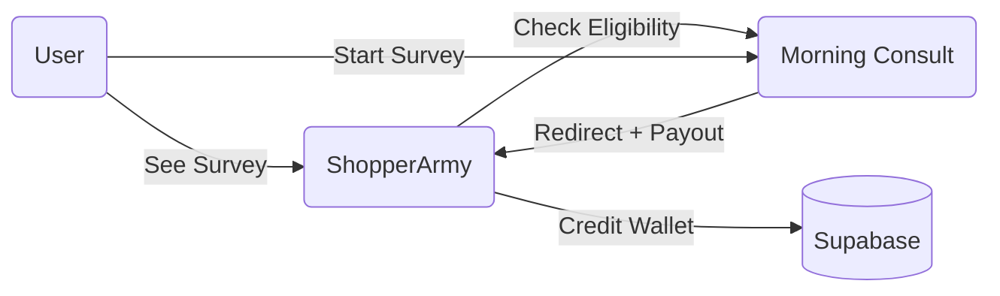

# Morning Consult Survey Integration - Technical Spec

**Version:** 1.0  
**Date:** January 30, 2026  
**Status:** Active Specification

## 1. Overview

ShopperArmy acts as a **supplier** in Morning Consult's Sample API ecosystem, sending our users (panelists) to complete surveys in exchange for payouts.

### Architecture



### Key Terminology

| MC Term      | ShopperArmy Equivalent | Description                        |
| :----------- | :--------------------- | :--------------------------------- |
| **Bid**      | Survey Opportunity     | A survey available for completion  |
| **Panelist** | ShopperArmy User       | Person taking the survey           |
| **CPI**      | Cost Per Interview     | What MC pays us (in **cents** USD) |
| **LOI**      | Length of Interview    | Survey duration (in **seconds**)   |
| **Quota**    | Targeting Group        | Demographic segment within a bid   |

## 2. Business Rules

### Configuration Defaults

- **Minimum CPI Threshold:** $2.00 (200 cents)
- **User Payout Percentage:** 50%
- **Minimum User Payout:** $1.00
- **Eligibility Cache TTL:** 60 seconds

### Payout Calculation Formula

```javascript
// user_payout is in DOLLARS
user_payout = (cpi_cents * user_payout_pct) / 100 / 100;
```

**Examples:**
| MC CPI | Show to User? | User Earns | ShopperArmy Keeps |
| :--- | :--- | :--- | :--- |
| $1.50 | ❌ No | — | — |
| $2.00 | ✅ Yes | **$1.00** | $1.00 |
| $3.00 | ✅ Yes | **$1.50** | $1.50 |
| $4.00 | ✅ Yes | **$2.00** | $2.00 |

## 3. User Flow & Implementation Details

### Step 1: Login & Eligibility Pre-fetch

When a user logs in, we fetch personalized survey availability.

- **Action:** `POST /supplier/eligibility`
- **Input:** User's age, gender, and list of active bid IDs from our DB.
- **Logic:** Filter response to keeping only bids with CPI >= $2.00.
- **Storage:** Save result in `user_survey_eligibility` table with `fetched_at` timestamp.

### Step 2: Feed Display

The mission feed displays a card based on cached eligibility.

- **Active:** If `user_survey_eligibility` has valid bids.
- **Disabled:** If no bids or cache expired (re-check on interaction).

### Step 3: Payout Modal

On click, re-verify freshness.

- **Logic:** If `fetched_at` > 60s ago, re-fetch from MC.
- **Display:** Show "Your Payout: $X.XX" and Estimated Time.

### Step 4: Entry URL Generation (CRITICAL)

We must generate a signed URL to send the user to MC.

**Base URL:** `https://surveys.insights-today.com/v1/survey/entry`

**Required Parameters:**

- `bid_id`: Target survey ID
- `panelist_id`: Our UUID for the user
- `supplier_id`: Our MC Supplier UUID
- `session_metadata`: Session UUID from `survey_sessions` table (used to track callback)
- `qualifications`: `age,25,gender,1` (Comma separated pairs)
- `signature`: **Ed25519 signature** of the query string

**Signing Process:**

1. Construct query string with all params EXCEPT `signature`.
2. Sign the query string using our Ed25519 **Private Key**.
3. Append `&signature={signature}` to the URL.

### Step 5: Redirect & Payout

MC redirects user back to ShopperArmy after attempt.

**Callback:** `https://shopperarmy.com/redirect` (or configured status-specific URL)

**Params received:**

- `status`: complete, screenout, quota_full, etc.
- `session_metadata`: Our Session UUID
- `signature`: MC's verification signature

**Verification Logic:**

1. **Verify Signature:** Check MC's signature against their **Public Key**. **REJECT if invalid.**
2. **Lookup Session:** Find `survey_sessions` where `id` matches `session_metadata`.
3. **Update Status:** Set session status to matched result.
4. **Credit User:** If status is `complete`, add transaction to user wallet.

## 4. Database Schema Updates

### `survey_providers` (Updated)

| Column            | Type  | Description                       |
| :---------------- | :---- | :-------------------------------- |
| `supplier_id`     | uuid  | MC Supplier UUID                  |
| `prescreener_url` | text  | Base URL for entry links          |
| `private_key`     | text  | **Encrypted** Ed25519 Private Key |
| `public_key`      | text  | Ed25519 Public Key                |
| `min_cpi_cents`   | int   | Default: 200                      |
| `redirect_urls`   | jsonb | Map of status -> URL template     |

### `survey_sessions` (New)

| Column            | Type      | Description                     |
| :---------------- | :-------- | :------------------------------ |
| `id`              | uuid      | PK                              |
| `user_id`         | uuid      | FK Users                        |
| `status`          | text      | pending, complete, screenout... |
| `mc_session_id`   | text      | MC's session ID                 |
| `expected_payout` | int       | Cents                           |
| `actual_payout`   | int       | Cents (from redirect)           |
| `completed_at`    | timestamp |                                 |

### `user_survey_eligibility` (New)

| Column          | Type      | Description         |
| :-------------- | :-------- | :------------------ |
| `user_id`       | uuid      | FK Users            |
| `eligible_bids` | jsonb     | Cached list of bids |
| `fetched_at`    | timestamp | For TTL check       |

## 5. Security & Keys

- **Algorithm:** Ed25519
- **storage:** Private keys MUST be encrypted at rest in the DB.
- **Rotation:** Admin dashboard provides UI to generate new keypair and re-register public key with MC.

## 6. MC API Endpoints

- **Eligibility:** `POST /supplier/eligibility`
- **Public Key Lookup:** `GET /lookup/public-key`
- **Register Key:** `POST /user/public-keys`
- **Set Redirects:** `PUT /user/redirect-urls/{status_id}`

## Overview

ShopperArmy integrates with Morning Consult's Sample API to provide survey opportunities to users. ShopperArmy acts as a **supplier** in MC's ecosystem, sending our panelists to complete surveys in exchange for payouts.

## Key Concepts

| MC Term      | ShopperArmy Equivalent | Description                        |
| ------------ | ---------------------- | ---------------------------------- |
| **Bid**      | Survey Opportunity     | A survey available for completion  |
| **Panelist** | User                   | Person taking the survey           |
| **CPI**      | Cost Per Interview     | What MC pays us (in **cents** USD) |
| **LOI**      | Length of Interview    | Survey duration (in **seconds**)   |
| **Quota**    | Targeting Group        | Demographic segment within a bid   |

## Business Rules

### Payout Structure

- **Minimum CPI Threshold**: \$2.00 (200 cents)
- **User Payout Percentage**: 50%
- **Minimum User Payout**: \$1.00
- **Eligibility Cache TTL**: 60 seconds

### Formula

```
user_payout = (CPI × 50%) / 100  // Convert cents to dollars
```

### Examples

| MC CPI | Show to User? | User Earns | ShopperArmy Keeps |
| ------ | ------------- | ---------- | ----------------- |
| \$1.50 | ❌ No         | —          | —                 |
| \$2.00 | ✓ Yes         | \$1.00     | \$1.00            |
| \$3.00 | ✓ Yes         | \$1.50     | \$1.50            |
| \$4.00 | ✓ Yes         | \$2.00     | \$2.00            |

## User Flow

1. **Login → Eligibility Pre-fetch**
   - Get user's profile (DOB → age, gender)
   - Fetch active bids from `survey_inventory` table
   - Call `POST /supplier/eligibility` with qualifications + bid IDs
   - Filter to bids with CPI ≥ \$2.00
   - Store in `user_survey_eligibility` with timestamp

2. **Feed Display → Survey Card**
   - **If eligible**: Show active card with "Earn \$1 or more"
   - **If no eligible surveys**: Show disabled "Check back later" state

3. **Card Tap → Re-fetch & Modal**
   - Check `fetched_at` timestamp
   - If older than 60s, re-fetch from MC
   - Calculate user payout: `(CPI × 50% / 100)`
   - Calculate time: `LOI / 60` → minutes
   - Display modal: "Your Payout: \$X.XX" + "~Y min"

4. **Start Survey → Entry URL**
   - Create `survey_sessions` record with status='pending'
   - Build entry URL with required params
   - Sign URL with Ed25519 private key
   - Open in new browser tab

5. **Survey Completion → Redirect**
   - Verify MC's signature on redirect URL
   - Look up session by `session_metadata`
   - Update status, actual_payout, completed_at
   - **If complete**: Credit user wallet
   - Display appropriate result screen

## Entry URL Format

```
https://surveys.insights-today.com/v1/survey/entry
  ?bid_id={bid_id}
  &panelist_id={user_id}
  &supplier_id={supplier_id}
  &session_metadata={our_session_id}
  &qualifications=age,{age},gender,{gender_code}
  &signature={ed25519_signature}
```

## Database Schema Changes

### survey_providers Table (Updates)

| Column                  | Type             | Description                          |
| ----------------------- | ---------------- | ------------------------------------ |
| `supplier_id`           | uuid             | MC supplier ID from /user/info       |
| `prescreener_url`       | text             | Base URL for entry links             |
| `private_key`           | text (encrypted) | Ed25519 private key                  |
| `public_key`            | text             | Ed25519 public key                   |
| `min_cpi_cents`         | integer          | Minimum CPI threshold (default: 200) |
| `user_payout_pct`       | integer          | User payout % (default: 50)          |
| `eligibility_cache_ttl` | integer          | Cache TTL in seconds (default: 60)   |
| `redirect_urls`         | jsonb            | Redirect URL templates by status     |

### New Table: survey_sessions

| Column            | Type        | Description                                                     |
| ----------------- | ----------- | --------------------------------------------------------------- |
| `id`              | uuid        | Primary key                                                     |
| `user_id`         | uuid        | FK to users.id                                                  |
| `provider_id`     | uuid        | FK to survey_providers.id                                       |
| `bid_id`          | text        | MC bid ID                                                       |
| `quota_id`        | text        | MC quota ID (if known)                                          |
| `cpi_at_click`    | integer     | CPI in cents when clicked                                       |
| `expected_payout` | integer     | Expected user payout (cents)                                    |
| `actual_payout`   | integer     | Actual payout from redirect                                     |
| `status`          | text        | pending, complete, screenout, over_quota, quality_term, timeout |
| `status_detail`   | text        | MC status_detail_id                                             |
| `mc_session_id`   | text        | MC session ID from redirect                                     |
| `started_at`      | timestamptz | When user clicked Start                                         |
| `completed_at`    | timestamptz | When redirect received                                          |

### New Table: user_survey_eligibility

| Column          | Type        | Description                              |
| --------------- | ----------- | ---------------------------------------- |
| `id`            | uuid        | Primary key                              |
| `user_id`       | uuid        | FK to users.id                           |
| `provider_id`   | uuid        | FK to survey_providers.id                |
| `eligible_bids` | jsonb       | Array of {bid_id, quota_ids[], cpi, loi} |
| `best_bid`      | jsonb       | Pre-computed best bid for quick display  |
| `fetched_at`    | timestamptz | When eligibility was fetched             |

## Redirect Statuses

| Status           | Description                  | Payout? |
| ---------------- | ---------------------------- | ------- |
| **complete**     | Survey finished successfully | ✅ Yes  |
| **screenout**    | User didn't qualify          | ❌ No   |
| **over_quota**   | Survey quota filled          | ❌ No   |
| **quality_term** | User failed quality check    | ❌ No   |
| **timeout**      | Session expired              | ❌ No   |

## MC API Endpoints Required

### For User Flow

- `POST /supplier/eligibility` - Check user eligibility for bids
- `GET /lookup/public-key` - Get MC's public key for signature verification

### For Admin Setup

- `POST /user/public-keys` - Register our public key with MC
- `PUT /user/redirect-urls/default` - Set default redirect URL
- `PUT /user/redirect-urls/{status_id}` - Set status-specific redirects

## Security Requirements

### Ed25519 URL Signing

- All entry URLs must be signed with Ed25519 to prevent tampering
- Generate key pair locally, register public key with MC
- Sign URL parameters before redirecting user to MC

### Signature Verification

- Verify MC's signature on all redirect callbacks
- Reject any redirect with invalid signature

## UI Components Required

### User-Facing

1. **Survey Card** - Active/disabled states for mission feed
2. **Offer Modal** - Shows payout and estimated time
3. **Redirect Pages** - Success, screenout, quota full, timeout, error

### Admin Dashboard

1. **Tabbed Provider Config** - General, Security, Redirects, Business Rules
2. **Key Generation UI** - Generate/copy Ed25519 key pairs
3. **Redirect URL Templates** - Configure per-status URLs
4. **Business Rules Inputs** - CPI threshold, payout %, cache TTL

## Success Criteria

1. ✅ Users see personalized survey offers on login
2. ✅ Payout calculation is accurate (50% of CPI)
3. ✅ Only surveys ≥\$2.00 CPI are shown
4. ✅ Entry URLs are properly signed with Ed25519
5. ✅ All redirect callbacks are verified
6. ✅ Completed surveys credit user wallet immediately
7. ✅ Admin can configure provider settings via UI
8. ✅ Eligibility cache refreshes every 60 seconds

## Questions to Resolve

1. Should we show multiple survey options or just one?
2. How to handle users with no demographic profile data?
3. What happens if MC's public key changes?
4. Should we track which quota the user qualified for?
5. How to handle partial completions or abandonments?

---

**Version**: 1.0  
**Date**: January 30, 2026  
**Status**: Draft - Pending Implementation
